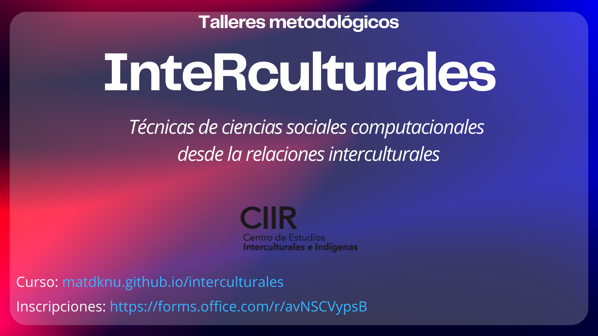

# Seminario Cuantitativo.

# ***InteRculturales:** Técnicas de ciencias sociales computacionales desde la relaciones interculturales.*

La unidad de estudios cuantitativos del Centro de Estudios Interculturales e Indígenas (CIIR) invita a participar en el seminario cuantitativo abierto:

InteRculturales: Técnicas de ciencias sociales computacionales desde la las relaciones interculturales.

El objetivo del Seminario es explorar diversas fuentes de datos contengan información sobre minorías étnicas y raciales en Chile y el mundo, integrando técnicas de ciencias sociales computacionales para abordar dinámicas intergrupales.

El foco estará puesto en el análisis de datos provenientes de censos y otras fuentes relevantes, con énfasis en el uso de herramientas de visualización y Sistemas de Información Geográfica (SIG) para mapear y contextualizar patrones de diversidad y desigualdad étnica. Asimismo, se trabajará en el análisis textual para explorar narrativas y discursos relacionados con etnicidad, discriminación y relaciones interculturales, utilizando bases de datos de encuestas, medios de comunicación y discursos presidenciales.

A lo largo del Seminario, los participantes aprenderán a aplicar metodologías innovadoras para procesar, analizar y comunicar resultados, integrando visualizaciones avanzadas en R que resalten las interacciones entre diferentes grupos étnicos, los sesgos presentes en los datos y las complejidades de las relaciones interculturales en diversos contextos.

Inscripciones aquí: *Pronto*

| Fecha | Contenido                                                         | Código práctico                                                                    | Ejercicios | Packages                           | Referencias                                                                |
|-------|-------------------------------------------------------------------|------------------------------------------------------------------------------------|------------|------------------------------------|----------------------------------------------------------------------------|
| 1     | Introducción al uso de R: Procesamiento de datos con Tidyverse I  | [Práctico 1](https://matdknu.github.io/cursoR-etnicidad/clases/clase1/clase1.html) |            | `Tidyverse`                        | [An Introduction to R](https://intro2r.com "An Introduction to R [Libro]") |
| 2     | Introducción al uso de R: Procesamiento de datos con Tidyverse II | [Práctico 2](https://matdknu.github.io/cursoR-etnicidad/clases/clase2/clase2.html) |            | `Tidyverse`                        | [R For Data Science](https://r4ds.had.co.nz/ "R For Data Science")         |
| 3     | Introducción a la visualización de datos: Uso de Ggplot2          | [Práctico 3](https://matdknu.github.io/cursoR-etnicidad/clases/clase3/clase3.html) |            | `Tidyverse`, `Ggplot2`             | [R For Data Science](https://r4ds.had.co.nz/ "R For Data Science")         |
| 4     | ¿Cuántos somos? Uso del CENSO y creación de Mapas                 | [Práctico 4](https://matdknu.github.io/cursoR-etnicidad/clases/clase5/clase5.html) |            | `ChileMapas`, `Censo`, `Tidyverse` | [R For Data Science](https://r4ds.had.co.nz/ "R For Data Science")         |
| 5     | Reportes automatizados en Quarto                                  | [Práctico 5](https://matdknu.github.io/cursoR-etnicidad/clases/clase5/clase5.html) | \|         | `Quarto`, `Tidyverse`              | [Tutorial Quarto](https://quarto.org/docs/get-started/hello/rstudio.html)  |
| 6     | Análisis de texto con R I                                         | [Práctico 6](https://matdknu.github.io/cursoR-etnicidad/clases/clase6/clase6.html) |            | `Quanteda`                         | [Text Mining with R](https://www.tidytextmining.com/)                      |
| 7     | Procesamiento de datos con Pandas (Python)                        | [Práctico 7](https://matdknu.github.io/cursoR-etnicidad/clases/clase7/clase7.html) |            | `Pandas`                           | [Guía de Uso PANDAS](https://pandas.pydata.org/docs/user_guide/index.html) |
| 8     | Uso de IA generativa                                              | [Práctico 8](https://matdknu.github.io/cursoR-etnicidad/clases/clase8/clase8.html) |            |                                    | [Documentación OpenAI](https://platform.openai.com/docs/)                  |

{width="701"}
